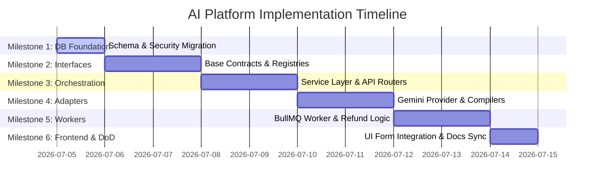

# Technical Implementation Plan — Wuzzkang AI Platform

> **Task Title:** Implementation of the Unified Wuzzkang AI Platform  
> **Status:** Awaiting Review  
> **Tracker ID:** WUZZKANG-AI-PLATFORM-PHASE-1  
> **Correlation ID:** [Dynamic tracing UUID for execution runs]

---

## 1. Objectives & Background

This plan maps the step-by-step technical implementation of the Wuzzkang AI Platform, adhering to the approved [Architecture Specification](file:///home/bms-del112/.gemini/antigravity-ide/brain/195092c2-d533-4f12-9e96-82ac5c395fd7/implementation_plan.md) and [Implementation Protocol](file:///home/bms-del112/BMS/personal-project/wuzzkang/wuzzkang-engineering/docs/98_IMPLEMENTATION_PROTOCOL.md).

The task is partitioned into **6 Milestones**, ordered progressively from the lowest architectural risk (foundations, schema creation) to the highest risk (third-party integration, background workers, and frontend bindings).

---

## 2. Proposed File Index

The implementation will introduce the following files across the monorepo:

### 2.1 Database & Migrations
*   **[NEW]** `wuzzkang-api/supabase/migrations/20260705_create_ai_tasks.sql` — Schema definition for `public.ai_tasks`.

### 2.2 Backend Abstractions & Orchestration (`wuzzkang-api/src/services/ai-platform/`)
*   **[NEW]** `AIProvider.js` — Base interface contract.
*   **[NEW]** `TaskCompiler.js` — Base compiler contract.
*   **[NEW]** `AIOrchestrationService.js` — Transaction & dispatch orchestrator.
*   **[NEW]** `AICostEstimator.js` — Pricing estimator reading from DB.
*   **[NEW]** `ModelResolver.js` — Dynamically resolves models.
*   **[NEW]** `ProviderRegistry.js` & `TaskCompilerRegistry.js` — Registries for plugins.
*   **[NEW]** `register.js` — Autoload registration file.

### 2.3 Storage Layer (`wuzzkang-api/src/services/storage/`)
*   **[NEW]** `StorageProvider.js` — Storage interface contract.
*   **[NEW]** `SupabaseStorageProvider.js` — Supabase storage adapter.

### 2.4 API & Routing
*   **[NEW]** `wuzzkang-api/src/routes/ai-platform.route.js` — Route declarations.

### 2.5 Queues & Background Workers
*   **[NEW]** `wuzzkang-api/src/queues/workers/aiTaskWorker.js` — BullMQ worker execution loop.

### 2.6 Frontend Layout (`wuzzkang-dashboard`)
*   **[MODIFY]** `src/app/generate/page.js` — Integrates form uploads and AI generation states.

---

## 3. Milestones & Task Checklist

### Milestone 1: Database Foundation & Schema Setup
*   **Risk:** Low (Isolated Database DDL script execution).
*   **Tasks:**
    *   **Task 1.1: Database Migration for `ai_tasks` table.**
        *   *Description:* Write SQL migration containing `idempotency_key`, partitioned states (`status`/`technical_status`), metadata columns, indexes, and updated_at trigger.
        *   *Dependency:* None.
        *   *Acceptance Criteria:* Table `public.ai_tasks` successfully created in Supabase with strict RLS policies limiting client SELECT commands to `auth.uid() = user_id`.

---

### Milestone 2: Unified Interface Definitions & Registries
*   **Risk:** Low (Static file structures, no external service dependencies).
*   **Tasks:**
    *   **Task 2.1: Abstraction interfaces for `AIProvider`, `TaskCompiler`, `StorageProvider`, `QueueAdapter`.**
        *   *Description:* Write the abstract base classes containing methods definitions, checks, and capabilities.
        *   *Dependency:* Milestone 1.
        *   *Acceptance Criteria:* All base files export standard ESM templates with `throw new Error('Method must be implemented')` fail-safes.
    *   **Task 2.2: Global registry module (`Registry` class and instances).**
        *   *Description:* Write `Registry.js` container and instantiate global registries for providers, storage, and compilers.
        *   *Dependency:* Task 2.1.
        *   *Acceptance Criteria:* Registries expose `.register(key, item)`, `.get(key)` methods and are tested via mock objects.
    *   **Task 2.3: Dynamic Model Resolver & AICostEstimator.**
        *   *Description:* Write pricing estimator mapping query database settings (`pricing_rules`), and Model Resolver loading defaults from providers.
        *   *Dependency:* Task 2.2.
        *   *Acceptance Criteria:* `AICostEstimator.estimateCost` returns correct pricing numbers. If `pricing_rules` is empty in database, fallback defaults are applied.

---

### Milestone 3: Platform Orchestrator (AIOrchestrationService)
*   **Risk:** Medium (API routing, wallet integration, and dispatch strategy).
*   **Tasks:**
    *   **Task 3.1: Implement `AIOrchestrationService` (Billing checks, cost estimation, database record creation, idempotency verification, sync/async strategy resolution).**
        *   *Description:* Write Orchestration logic to handle atomic credit checks via wallet RPC, create `ai_tasks` entry in `queued` status, and resolve execution path.
        *   *Dependency:* Milestone 2.
        *   *Acceptance Criteria:* If user tries to re-submit same `idempotency_key` within 60s, orchestrator returns original task data without charging wallet.
    *   **Task 3.2: API boundary routing & Zod validation schema definition.**
        *   *Description:* Create `ai-platform.route.js` router validating incoming payload fields and mounting routes under `/api/v1/ai/*`.
        *   *Dependency:* Task 3.1.
        *   *Acceptance Criteria:* Router returns `202 Accepted` with `taskId` for async jobs, and blocks payloads not matching input assets schema with `400 Bad Request`.

---

### Milestone 4: Storage & Gemini Provider Implementations
*   **Risk:** Medium (Third-party SDK integrations, prompt compilation rules).
*   **Tasks:**
    *   **Task 4.1: Concrete `SupabaseStorageProvider` (implements StorageProvider).**
        *   *Description:* Write Supabase Storage SDK file upload wrapper.
        *   *Dependency:* Task 2.1.
        *   *Acceptance Criteria:* Provider successfully uploads media buffers to the configured bucket.
    *   **Task 4.2: Concrete `GeminiProvider` (implements AIProvider, utilizes `@google/generative-ai` SDK, implements capability checks, downloads input assets to tmp/stream).**
        *   *Description:* Implement Gemini image/text generation execution adapters.
        *   *Dependency:* Task 2.1.
        *   *Acceptance Criteria:* Provider capability checks return correct flags (e.g. `supportsNegativePrompt()` returns false, `supportsImageGeneration()` returns true).
    *   **Task 4.3: Concrete `WeddingTaskCompiler` (implements TaskCompiler).**
        *   *Description:* Implement Prompt compiler translating wedding context variables (names, style keys, background details) to TaskPayload.
        *   *Dependency:* Task 2.1.
        *   *Acceptance Criteria:* Compiles input context variables into structured JSON matching Zod `TaskPayload` spec.

---

### Milestone 5: Asynchronous Queue Worker (BullMQ Worker)
*   **Risk:** High (Background concurrency scheduling, failure refund loops).
*   **Tasks:**
    *   **Task 5.1: Create `QueueAdapter` implementation (BullMQ wrapper) and register worker `aiTaskWorker.js`.**
        *   *Description:* Write background task queue listener executing providers, storing outcomes, and transitioning states.
        *   *Dependency:* Milestone 3 & Milestone 4.
        *   *Acceptance Criteria:* As tasks progress, database entries transition technical status (`uploading_assets` -> `building_prompt` -> `calling_provider` -> `saving_result`) and complete with result URL.
    *   **Task 5.2: Rollback & Refund Compensation Handlers.**
        *   *Description:* Integrate refund transactions into task failure callbacks.
        *   *Dependency:* Task 5.1.
        *   *Acceptance Criteria:* Tasks reaching `failed` state after 3 BullMQ retries trigger `walletService.addTransaction(userId, cost, 'refund')` atomically.

---

### Milestone 6: Frontend Integration & Validation
*   **Risk:** High (End-to-end integration, user experience progress feedback).
*   **Tasks:**
    *   **Task 6.1: Wedding form client updates (handles multiple assets uploads, triggers `execute`, polls task status).**
        *   *Description:* Connect wedding form frontend component to execute API and render polling progress.
        *   *Dependency:* Milestone 5.
        *   *Acceptance Criteria:* Client dashboard shows progress states, handles timeout cases, and loads generated assets directly into live preview context.
    *   **Task 6.2: Documentation Sync (Definition of Done verification).**
        *   *Description:* Sync and update API specifications, database architectures, and roadmap documents.
        *   *Dependency:* Task 6.1.
        *   *Acceptance Criteria:* All changed modules align with the repository map; lint builds verify no warnings exist.

---

## 4. Verification Plan

### 4.1 E2E Verification Flow
1.  **Init:** User wallet holds 10 credits.
2.  **Upload:** User uploads groom and bride photos → gets public URLs.
3.  **Execute:** Client sends POST `/api/v1/ai/task/execute` with assets and background parameters.
4.  **Billing Check:** Wallet balance drops to 8 credits. `public.ai_tasks` has 1 record with status `queued`.
5.  **Job Enqueue:** BullMQ worker picks up job.
6.  **Polling:** Client polls GET `/api/v1/ai/task/jobs/:id` every 2s → shows `preparing_assets` -> `generating` -> `completed`.
7.  **Finalize:** Job completed. Result URL is verified as loaded. Wallet balance is confirmed at 8 credits.
