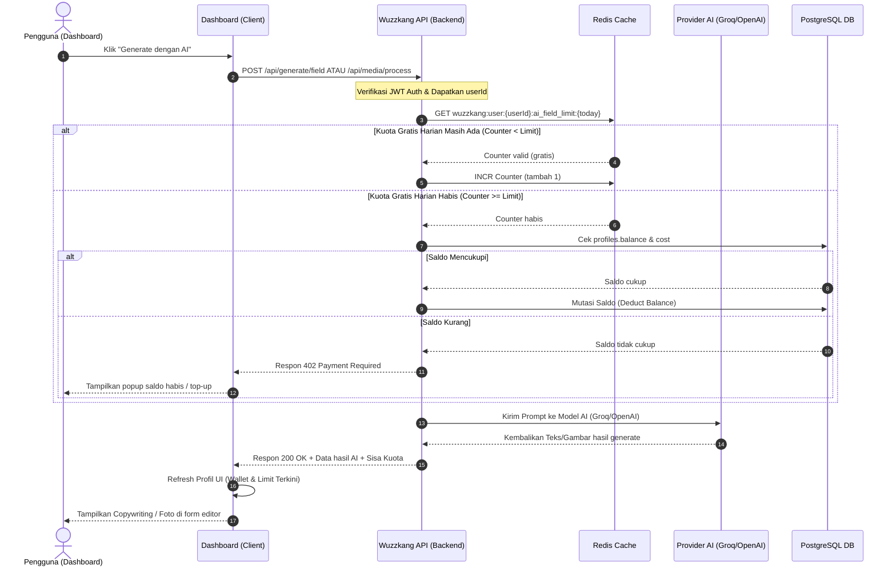
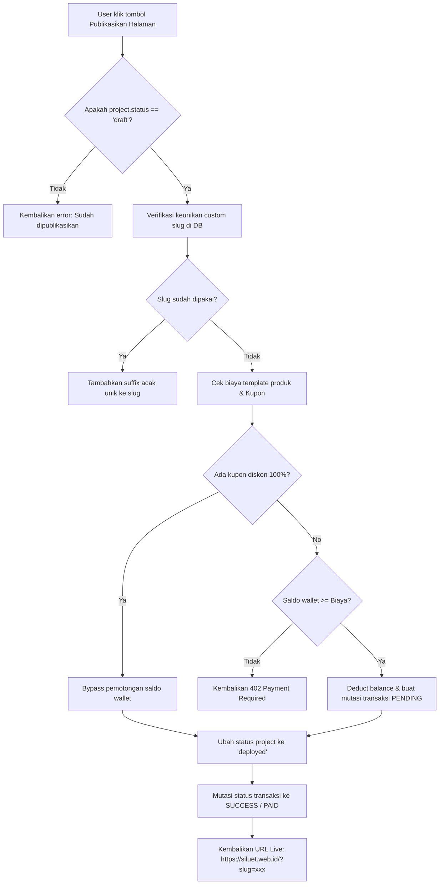
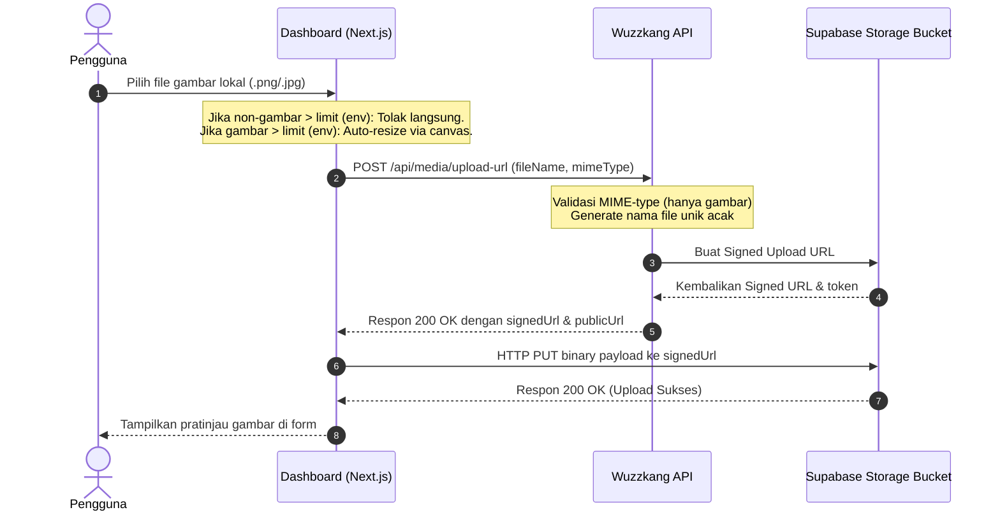
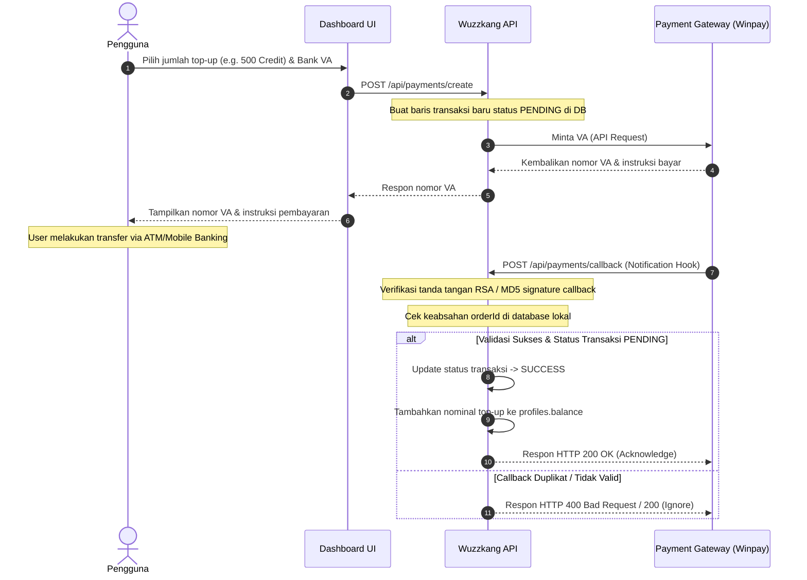

# 🗺️ Peta Alur Sistem (Flow Map) — Wuzzkang

Dokumen ini memetakan alur kerja runtime (*runtime flows*) utama di platform Wuzzkang. Peta alur ini berfungsi sebagai acuan bagi developer untuk memahami interaksi antarkomponen (Dashboard, API, Redis, Database, dan LP Runtime).

---

## 1. Alur Asisten AI & Pemeriksaan Kuota (Billing Check)

Alur ini memetakan apa yang terjadi saat user memicu tombol generate teks atau gambar berbasis AI di formulir editor dashboard.



---

## 2. Alur Publikasi / Penerbitan Landing Page (Deployment)

Alur mutasi finansial dan publikasi ketika draf halaman diubah statusnya menjadi aktif (*deployed*).



---

## 3. Alur Unggah Gambar Terproteksi (Direct Upload via Signed URL)

Keamanan penulisan file gambar ke Supabase Storage tanpa membebani memori server backend atau mengekspos kunci admin pada sisi klien.



---

## 4. Alur Pratinjau Iframe & Perenderan Landing Page Live

Proses transformatif data JSON dari Supabase menjadi representasi visual HTML menggunakan kode runtime perender terpusat.

```mermaid
flowchart TD
    subgraph Browser User
        A[Akses URL: siluet.web.id/?slug=xyz] --> B[script.js dijalankan]
    end
    subgraph Supabase DB
        B --> C[Fetch pageConfig & template_type & design_key berdasarkan slug]
    end
    C --> D{Data ditemukan?}
    D -- Tidak --> E[Tampilkan halaman 404 Not Found]
    D -- Ya --> F[Baca LP_VERSION & bentuk cacheBust query]
    F --> G[Dynamic import template: templates/type/design_key.js?v=LP_VERSION]
    G --> H[Jalankan fungsi template.render(pageConfig, guestName)]
    H --> I[HTML disuntikkan ke kontainer div #app]
```

---

## 5. Alur Top-Up Wallet (Payment Gateway Callback)

Siklus pengisian saldo akun pengguna menggunakan Virtual Account (VA) secara real-time.


