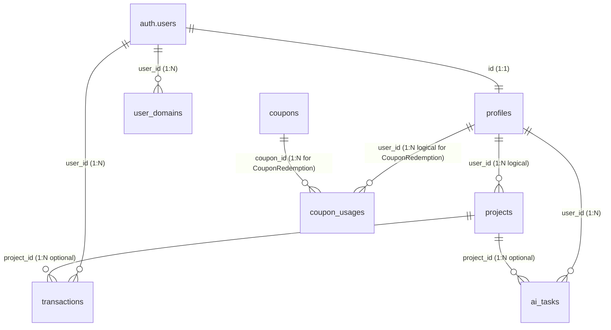
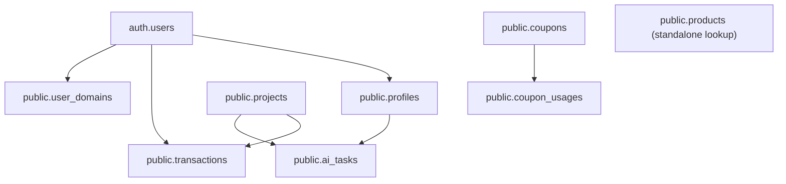

# Wuzzkang Physical Database Architecture Specification

---

## Document Information

| Field | Value |
|---|---|
| Version | 1.1.0 |
| Status | Structure Approved |
| Target System | Wuzzkang Core Database (PostgreSQL / Supabase Managed) |

---

## Purpose of This Document

This document defines the physical database architecture of Wuzzkang. It serves as the canonical technical reference for engineers on how the platform's domain model, access controls, performance indexes, and ledger constraints are physically implemented at the PostgreSQL and Supabase level.

---

## Out of Scope

This document does not describe:
- High-level business concepts or logical domain models (documented in `04_DOMAIN_MODEL.md`).
- General software system architecture and service layering rules (documented in `03_ARCHITECTURE.md`).
- API endpoint parameters, payload validation schemas, or application route configurations.
- Step-by-step audit quality findings or database issues (documented in `audit/DATABASE_AUDIT_2026_07_01.md`).

---

## Part 1 — Database Ownership & Access Architecture
* **Purpose:** Define physical data ownership boundaries and permission levels for connected applications and services.
* **Scope:** Database role credentials, client connections, service-role bypass mechanisms, and public read-only access schemas.
* **Out of Scope:** API authentication logic, token generation processes, or user registration flows.

### 1.1 Owner Roles and Service Bypass
The database schema and objects in the `public` schema are owned by the `postgres` role (a superuser role managed by Supabase). Application access is segmented using specific PostgREST/Supabase connection credentials:
* **Service Role (`service_role`):** Used exclusively by the `wuzzkang-api` service layer (as defined in `03_ARCHITECTURE.md`). The service client initiates connections using the secret `SUPABASE_SERVICE_KEY`. All operations executed under this role bypass Row-Level Security (RLS) constraints, permitting full read and write access to all schemas and tables.
* **Authenticated Role (`authenticated`):** Used by authenticated clients to query specific tables directly. RLS policies restrict operations to rows matching the client's verified user ID (`auth.uid()`).
* **Anonymous Role (`anon`):** Used for unauthenticated clients, such as public visitors fetching live landing page layouts. RLS limits this role to read-only (`SELECT`) operations on resources with explicit public status, such as deployed projects.

### 1.2 Access Paths and Connection Models
* **PostgREST HTTP Gateway:** Used for standard operations from the dashboard and landing page. Requests are dynamically routed and filtered by the built-in PostgREST API according to RLS permissions.
* **Direct TCP Connection:** Not used by the dashboard or rendering engine; backend management scripts or direct migration commands connect to the PostgreSQL instance via standard TCP port 5432 using postgres credentials (as verified in backend configurations).

---

## Part 2 — Database Object Inventory
* **Purpose:** Provide a quick, high-level architectural catalog of all physical database objects.
* **Scope:** Grouped listing of Schemas, Tables, Views, Enums, Functions, Triggers, Indexes, RLS Policies, and Storage Buckets.
* **Out of Scope:** Detailed property descriptions, columns, or syntax definitions of individual objects.

### 2.1 Inventory List
The Wuzzkang database consists of the following objects, verified against migration histories and active database configurations:
* **Schemas:** `public` (application), `auth` (identity/access), `extensions` (helpers), `vault` (secrets).
* **Tables:**
  * `public.profiles`
  * `public.projects`
  * `public.transactions`
  * `public.user_domains` *(Unused schema)*
  * `public.products`
  * `public.coupons`
  * `public.coupon_usages`
  * `public.system_settings`
  * `public.ai_tasks`
* **Views:** None (no views are defined in the schema migrations).
* **Enums:** `public.transaction_status` (values: `'PENDING'`, `'PAID'`, `'EXPIRED'`, `'FAILED'`).
* **Functions:**
  * `public.handle_updated_at()`
  * `public.handle_new_user()`
  * `public.get_or_create_profile(p_user_id UUID)`
  * `public.deduct_user_balance(p_user_id UUID, p_amount BIGINT, p_type TEXT, p_project_id UUID, p_description TEXT, p_metadata JSONB)`
* **Triggers:**
  * `set_profiles_updated_at` ON `public.profiles` (BEFORE UPDATE)
  * `on_auth_user_created` ON `auth.users` (AFTER INSERT)
  * `set_ai_tasks_updated_at` ON `public.ai_tasks` (BEFORE UPDATE)
* **Indexes:**
  * `idx_projects_user_id` ON `public.projects` (user_id)
  * `idx_projects_slug` ON `public.projects` (slug)
  * `idx_transactions_order_id` ON `public.transactions` (order_id)
  * `idx_coupons_code_lower` ON `public.coupons` (LOWER(code))
  * `idx_coupon_usages_user_id_coupon_id` ON `public.coupon_usages` (user_id, coupon_id)
  * `idx_ai_tasks_user_status` ON `public.ai_tasks` (user_id, status)
  * `idx_ai_tasks_provider_model` ON `public.ai_tasks` (provider, model)
  * `idx_ai_tasks_project_id` ON `public.ai_tasks` (project_id)
* **RLS Policies:** Explicit policies are configured on `profiles`, `projects`, `transactions`, `products`, `coupons`, `coupon_usages`, `system_settings`, and `ai_tasks` tables (detailed in Part 13).
* **Storage Buckets:** `wuzzkang-bucket` (public bucket for static media assets).
* **Extensions:** `pgcrypto`, `uuid-ossp`, `pg_stat_statements`, `supabase_vault`.

---

## Part 3 — Database Conventions
* **Purpose:** Specify database-wide conventions and formatting rules to ensure schema consistency.
* **Scope:** UUID usage policies, snake_case formatting rules, plural table naming rules, timestamp formats, soft delete exclusions, and default audit column requirements.
* **Out of Scope:** Coding style conventions for JavaScript/HTML or repository structure.

### 3.1 Naming and Format Conventions
* **Case and Syntax:** All table, column, enum, index, function, and trigger names use `snake_case` (lowercase with underscores).
* **Pluralization:** Table names are pluralized (e.g. `projects`, `profiles`, `transactions`), except for reference configurations or settings tables containing singular value keys (e.g. `system_settings`).
* **Identifiers:** Primary keys are consistently named `id`. For tables referencing auth identities, `id` acts as both primary key and foreign key (e.g., `profiles.id REFERENCES auth.users(id)`). Other tables generate unique UUID identifiers automatically using `gen_random_uuid()` from the `pgcrypto` extension.
* **Date and Time:** Timestamps are stored using the `TIMESTAMPTZ` data type (timestamp with time zone) to prevent timezone drift, defaulting to `NOW()`.
* **Audit Columns:** Tables tracking state updates contain `created_at` and `updated_at` timestamps. `updated_at` columns are managed automatically using database triggers invoking the `handle_updated_at()` trigger function.
* **Deletions:** The database enforces a hard delete model using cascade constraints (`ON DELETE CASCADE`, `ON DELETE SET NULL`) rather than a soft-delete pattern. No `deleted_at` fields exist in the database schema.

## Part 4 — PostgreSQL Extensions
* **Purpose:** Document active PostgreSQL and Supabase extensions utilized in the database.
* **Scope:** Installed Extensions, Purpose, Current Usage, and Verification Status of active or unused extensions.
* **Out of Scope:** Low-level PostgreSQL engine installation procedures or system library dependencies.

### 4.1 Installed Extensions List
The following extensions are installed on the database cluster, verified against the migration history (specifically `20260620063900_remote_schema.sql`):
* **`uuid-ossp`** (Schema: `extensions`):
  * **Purpose:** Standard PostgreSQL extension containing functions to generate universally unique identifiers (UUIDs) using various algorithms.
  * **Current Usage:** Used to generate unique identifiers for database records (e.g. primary keys).
  * **Verification Status:** **Verified**. Used in primary key constraints across the schema.
* **`pgcrypto`** (Schema: `extensions`):
  * **Purpose:** Provides cryptographic functions for PostgreSQL, including hashing and random UUID generation.
  * **Current Usage:** Specifically, `gen_random_uuid()` is designated as default value generator for table primary keys.
  * **Verification Status:** **Verified**. Called by table defaults (e.g. `projects.id` and `transactions.id`).
* **`pg_stat_statements`** (Schema: `extensions`):
  * **Purpose:** Tracks execution statistics of all SQL statements executed on the cluster for query analysis and performance tuning.
  * **Current Usage:** Enables query analysis and profiling via Supabase Dashboard.
  * **Verification Status:** **Verified**. Registered in the base remote schema migration.
* **`supabase_vault`** (Schema: `vault`):
  * **Purpose:** Supabase internal secrets manager utilizing vault schemas to securely store application keys and environment variables.
  * **Current Usage:** Internal Supabase auth, storage, and platform operations.
  * **Verification Status:** **Verified**. Registered in the base remote schema migration.
* **`pgjwt`** (Schema: `extensions`):
  * **Purpose:** Provides functions to sign and verify JSON Web Tokens (JWT) directly inside the database.
  * **Current Usage:** Internal Supabase authentication verification.
  * **Verification Status:** **Not Verified** in migration scripts (no explicit registration statement is found, though implicitly present in Supabase Auth dependencies).

---

## Part 5 — Database Schemas
* **Purpose:** Define the logical schemas (namespaces) separating database objects.
* **Scope:** Boundaries, ownerships, and search paths for `public`, `auth`, `extensions`, and `vault`.
* **Out of Scope:** Local deployment environment setups or Supabase hosting configurations.

### 5.1 Schema Inventory and Boundaries
The database divides namespace ownership across four primary PostgreSQL schemas:
* **`public`**:
  * **Boundary:** Default schema for all Wuzzkang application tables, types, enums, triggers, and custom stored procedures/functions.
  * **Ownership:** Owned by the `postgres` role.
  * **Search Path:** Configured as the first entry in default user search paths.
* **`auth`**:
  * **Boundary:** Schema owned and managed by Supabase Auth engine. It contains tables (e.g., `auth.users`, `auth.sessions`) and helper functions regulating user authentication.
  * **Ownership:** Managed by Supabase platform.
  * **Search Path:** Access restricted; `public` schema triggers and definer functions accessing it must explicitly specify paths to avoid resolution hijacking.
* **`extensions`**:
  * **Boundary:** Standard namespace hosting third-party PostgreSQL extensions (e.g., `uuid-ossp`, `pgcrypto`).
  * **Ownership:** Managed by system administrator.
* **`vault`**:
  * **Boundary:** Separated schema containing vault encryption keys and secrets tables.
  * **Ownership:** Owned by Supabase managed vaults.

---

## Part 6 — Custom Enums
* **Purpose:** Document custom enum types defined at the database layer.
* **Scope:** Custom type signatures and allowed values (specifically `public.transaction_status`).
* **Out of Scope:** Runtime Enum configurations in application frameworks.

### 6.1 `public.transaction_status`
Created to enforce strict status mapping on transaction records.
```sql
CREATE TYPE public.transaction_status AS ENUM ('PENDING', 'PAID', 'EXPIRED', 'FAILED');
```
* **Verifiability:** **Verified**. Created in migration `20260622130000_add_winpay_fields_to_transactions.sql` (lines 5-9) and referenced as data type for the `status` column in `public.transactions`.

## Part 7 — Domain Entity → Physical Table Mapping
* **Purpose:** Show how logical business entities defined in the domain model are physically mapped to PostgreSQL tables.
* **Scope:** Explicit mapping pairings between the domain entities (User, Profile, Project, Transaction, Coupon, CouponRedemption, Product, Settings) and database tables (`auth.users`, `profiles`, `projects`, `transactions`, `coupons`, `coupon_usages`, `products`, `system_settings`).
* **Out of Scope:** Detailed columns definitions or constraints mappings.

### 7.1 Entity-to-Table Mapping Catalog
The following table matches the conceptual business entities from `04_DOMAIN_MODEL.md` to their physical SQL tables in PostgreSQL:

| Domain Entity / Concept | PostgreSQL / Supabase Schema Object |
|---|---|
| **User** | `auth.users` (Supabase Internal Auth schema table) |
| **Profile** | `public.profiles` |
| **Wallet** | Mapped directly to `profiles.balance` column (holds amount) |
| **Project** | `public.projects` |
| **pageConfig** | Mapped directly to `projects.page_data` (`JSONB` Value Object) |
| **Transaction** | `public.transactions` |
| **Coupon** | `public.coupons` |
| **CouponRedemption** | `public.coupon_usages` |
| **Product** | `public.products` (lookup catalog) |
| **Settings** | `public.system_settings` |
| **UserDomain** | `public.user_domains` *(Unused schema)* |

---

## Part 8 — Physical Table Specifications

### 8.1 profiles
* **Purpose:** Document the physical schema of the `public.profiles` table.
* **Scope:** Column names, SQL data types, nullability, default values, and column-level descriptions.
* **Out of Scope:** Profiles entity logical definition.

#### Table Definition: `public.profiles`
| Column Name | SQL Data Type | Nullability | Default Value | Description / Constraints |
|---|---|---|---|---|
| `id` | `UUID` | `NOT NULL` | - | Primary Key. References `auth.users(id)` via `ON DELETE CASCADE`. |
| `balance` | `BIGINT` | `NOT NULL` | `0` | Total user wallet balance stored in Credit units. |
| `email` | `TEXT` | `NULL` | - | Cached user email, synchronized from `auth.users` on insert. |
| `full_name` | `TEXT` | `NULL` | - | Cached full name metadata, synchronized from `auth.users` on insert. |
| `avatar_url` | `TEXT` | `NULL` | - | Cached avatar metadata, synchronized from `auth.users` on insert. |
| `daily_ai_limit` | `INTEGER` | `NULL` | `NULL` | Maximum daily free AI quota. If `NULL`, falls back to system settings default. |
| `ai_generate_cost` | `BIGINT` | `NULL` | `NULL` | Unit cost in Credits per AI generation after quota. If `NULL`, falls back to system settings default. |
| `tracking_config` | `JSONB` | `NULL` | `NULL` | Tracking pixel configuration object. Keys: `facebook_pixel_id`, `google_analytics_id`, `google_ads_id`, `tiktok_pixel_id`. Merged into `page_data.meta` at generate-time. |
| `role` | `TEXT` | `NOT NULL` | `'user'` | Security access role check: `('user', 'admin', 'super_admin')`. Column-level trigger `protect_profile_role` prevents client-side updates. |
| `updated_at` | `TIMESTAMPTZ` | `NULL` | `NOW()` | Timestamp of last row mutation. Automatically updated via `handle_updated_at` trigger. |

### 8.2 projects
* **Purpose:** Document the physical schema of the `public.projects` table.
* **Scope:** Column names, SQL data types, nullability, default values, and column-level descriptions.
* **Out of Scope:** Projects entity logical definition.

#### Table Definition: `public.projects`
| Column Name | SQL Data Type | Nullability | Default Value | Description / Constraints |
|---|---|---|---|---|
| `id` | `UUID` | `NOT NULL` | `gen_random_uuid()` | Primary Key. |
| `user_id` | `UUID` | `NOT NULL` | - | Owner identifier. Verified as logical reference to `auth.users(id)` or `profiles(id)` (no physical constraint). |
| `name` | `TEXT` | `NOT NULL` | - | Project display name. |
| `page_data` | `JSONB` | `NOT NULL` | - | Semantic data layout contract (`pageConfig` Value Object). |
| `repo_url` | `TEXT` | `NULL` | - | GitHub repository path. |
| `live_url` | `TEXT` | `NULL` | - | Deployed public production URL. |
| `status` | `TEXT` | `NULL` | `'draft'` | Lifecycle status of the project (e.g. `'draft'`, `'deploying'`, `'deployed'`, `'failed'`). |
| `slug` | `TEXT` | `NULL` | - | Unique URL slug identifier. Enforced by unique index. |
| `edit_count` | `INTEGER` | `NULL` | `0` | Number of edits applied to project pages after live deployment. |
| `custom_domain` | `TEXT` | `NULL` | - | Target domain mapping. |
| `domain_type` | `TEXT` | `NOT NULL` | `'none'` | Domain configuration type: `'none'`, `'subdomain'`, `'custom'`. |
| `domain_status` | `TEXT` | `NULL` | `'none'` | Custom domain status flag (e.g. `'none'`, `'pending_dns'`, `'verifying'`, `'active'`, `'failed'`). |
| `domain_provider_order_id` | `TEXT` | `NULL` | - | Domain provider identifier. |
| `created_at` | `TIMESTAMPTZ` | `NULL` | `NOW()` | Row insertion timestamp. |
| `updated_at` | `TIMESTAMPTZ` | `NULL` | `NOW()` | Last update timestamp. |


### 8.3 transactions
* **Purpose:** Document the physical schema of the `public.transactions` table.
* **Scope:** Column names, SQL data types, nullability, default values, and column-level descriptions.
* **Out of Scope:** Transactions entity logical definition.

#### Table Definition: `public.transactions`
| Column Name | SQL Data Type | Nullability | Default Value | Description / Constraints |
|---|---|---|---|---|
| `id` | `UUID` | `NOT NULL` | `gen_random_uuid()` | Primary Key. |
| `user_id` | `UUID` | `NOT NULL` | - | References `auth.users(id)` via `ON DELETE CASCADE`. |
| `amount` | `BIGINT` | `NOT NULL` | - | Balance change value in Credits. Credit top-ups are positive, debit deployments are negative. Raw cash values and prices are stored in metadata. |
| `type` | `TEXT` | `NOT NULL` | - | Transaction category identifier (e.g. `'topup'`, `'deployment'`, `'refund'`, `'ai_generation'`). |
| `project_id` | `UUID` | `NULL` | - | Optional project link. References `public.projects(id)` via `ON DELETE SET NULL`. |
| `description` | `TEXT` | `NULL` | - | Audit trail description. |
| `metadata` | `JSONB` | `NULL` | `'{}'::JSONB` | Optional audit metadata JSON payload (keys: `channel`, `customerNo`, `cash_amount`, `credit_price`, `qr_image_url`, `confirm_payment_url`, `mode`, `expired_at`). |
| `order_id` | `TEXT` | `NULL` | - | Unique external payment/top-up tracking ID. Enforced by unique constraint. |
| `va_number` | `TEXT` | `NULL` | - | Virtual Account settlement identifier. |
| `status` | `public.transaction_status` | `NULL` | `'PENDING'` | Status reference from `transaction_status` enum. |
| `created_at` | `TIMESTAMPTZ` | `NULL` | `NOW()` | Ledger insertion timestamp. |

### 8.4 coupons
* **Purpose:** Document the physical schema of the `public.coupons` table.
* **Scope:** Column names, SQL data types, nullability, default values, and column-level descriptions.
* **Out of Scope:** Coupons entity logical definition.

#### Table Definition: `public.coupons`
| Column Name | SQL Data Type | Nullability | Default Value | Description / Constraints |
|---|---|---|---|---|
| `id` | `UUID` | `NOT NULL` | `gen_random_uuid()` | Primary Key. |
| `code` | `TEXT` | `NOT NULL` | - | Unique coupon promo code. Enforced by unique lower expression index. |
| `discount_type` | `TEXT` | `NOT NULL` | - | Discount calculation rule (`'percentage'` or `'fixed_amount'`). |
| `discount_value` | `NUMERIC` | `NOT NULL` | - | Value applied based on type definition. |
| `max_uses` | `INTEGER` | `NULL` | - | Global redemption limit. `NULL` implies unlimited uses. |
| `uses_count` | `INTEGER` | `NULL` | `0` | Running counter of total successful redemptions. |
| `max_uses_per_user` | `INTEGER` | `NULL` | `1` | Maximum redemptions permitted per user profile. |
| `expires_at` | `TIMESTAMPTZ` | `NULL` | - | Expiration limit timestamp. |
| `is_active` | `BOOLEAN` | `NULL` | `TRUE` | Activation status flag. |
| `created_at` | `TIMESTAMPTZ` | `NULL` | `NOW()` | Record creation timestamp. |

### 8.5 coupon_usages
* **Purpose:** Document the physical schema of the `public.coupon_usages` table.
* **Scope:** Column names, SQL data types, nullability, default values, and column-level descriptions.
* **Out of Scope:** CouponRedemption entity logical definition.

#### Table Definition: `public.coupon_usages`
| Column Name | SQL Data Type | Nullability | Default Value | Description / Constraints |
|---|---|---|---|---|
| `id` | `UUID` | `NOT NULL` | `gen_random_uuid()` | Primary Key. |
| `coupon_id` | `UUID` | `NULL` | - | Parent coupon link. References `public.coupons(id)` via `ON DELETE CASCADE`. |
| `user_id` | `UUID` | `NOT NULL` | - | User reference. Logical relation to `auth.users(id)` or `profiles(id)` (no physical constraint). |
| `used_at` | `TIMESTAMPTZ` | `NULL` | `NOW()` | Timestamp of redemption creation. |

### 8.6 products
* **Purpose:** Document the physical schema of the `public.products` table.
* **Scope:** Column names, SQL data types, nullability, default values, and column-level descriptions.
* **Out of Scope:** Products catalog entity logical definition.

#### Table Definition: `public.products`
| Column Name | SQL Data Type | Nullability | Default Value | Description / Constraints |
|---|---|---|---|---|
| `id` | `TEXT` | `NOT NULL` | - | Primary Key (stores template identifiers, e.g. `'wedding'`, `'birthday'`, `'toko-online'`). |
| `name` | `TEXT` | `NOT NULL` | - | Catalog product description. |
| `is_active` | `BOOLEAN` | `NULL` | `TRUE` | Status flag. |
| `cost` | `INTEGER` | `NULL` | `100` | Cost per deployment in Credits. |
| `unit` | `TEXT` | `NULL` | `'Halaman'` | Product denominator unit label. |
| `priority` | `INTEGER` | `NULL` | `NULL` | Ordering priority (lower/higher value affects frontend placement sorting). |
| `created_at` | `TIMESTAMPTZ` | `NULL` | `NOW()` | Record insertion timestamp. |


### 8.7 system_settings
* **Purpose:** Document the physical schema of the `public.system_settings` table.
* **Scope:** Column names, SQL data types, nullability, default values, and column-level descriptions.
* **Out of Scope:** System settings logical definition.

#### Table Definition: `public.system_settings`
| Column Name | SQL Data Type | Nullability | Default Value | Description / Constraints |
|---|---|---|---|---|
| `key` | `TEXT` | `NOT NULL` | - | Primary Key config name. Keys: `'subdomain_pricing'` holds JSONB configuration; `'max_project_edits'` holds integer maximum free edits limit (default 3); `'project_edit_cost'` holds integer credit cost per paid edit (default 1). |
| `value` | `JSONB` | `NOT NULL` | - | Stored configuration setting value payload. |
| `description` | `TEXT` | `NULL` | - | Metadata description of the setting constant. |
| `created_at` | `TIMESTAMPTZ` | `NULL` | `NOW()` | Record creation timestamp. |
| `updated_at` | `TIMESTAMPTZ` | `NULL` | `NOW()` | Last modified timestamp. Automatically updated via trigger handler. |


### 8.8 ai_tasks
* **Purpose:** Document the physical schema of the `public.ai_tasks` table tracking all AI task executions.
* **Scope:** Column names, SQL data types, nullability, default values, and column-level descriptions.
* **Out of Scope:** Application-level AI providers and registries logic.

#### Table Definition: `public.ai_tasks`
| Column Name | SQL Data Type | Nullability | Default Value | Description / Constraints |
|---|---|---|---|---|
| `id` | `UUID` | `NOT NULL` | `gen_random_uuid()` | Primary Key. |
| `user_id` | `UUID` | `NOT NULL` | - | Owner identifier. References `public.profiles(id)` via `ON DELETE CASCADE`. |
| `project_id` | `UUID` | `NULL` | - | Optional project link. References `public.projects(id)` via `ON DELETE SET NULL`. |
| `idempotency_key` | `TEXT` | `NULL` | - | Unique request identifier to prevent duplicate execution/billing. Enforced by unique constraint. |
| `status` | `TEXT` | `NOT NULL` | `'queued'` | Business lifecycle status. Check constraint: `'queued'`, `'processing'`, `'completed'`, `'failed'`, `'cancelled'`. |
| `technical_status` | `TEXT` | `NOT NULL` | `'none'` | Granular technical status. Check constraint: `'none'`, `'uploading_assets'`, `'building_prompt'`, `'calling_provider'`, `'saving_result'`, `'retrying'`. |
| `credits_used` | `BIGINT` | `NOT NULL` | `0` | Wallet credits consumed by this task. |
| `provider` | `TEXT` | `NOT NULL` | `''` | Name of the AI provider utilized (e.g. `'gemini'`). |
| `model` | `TEXT` | `NOT NULL` | `''` | Model name/version utilized (e.g. `'gemini-2.5-flash'`). |
| `result_url` | `TEXT` | `NULL` | - | Public URL to the generated output asset (if successful). |
| `error_message` | `TEXT` | `NULL` | - | Execution error message (if task failed). |
| `request_payload` | `JSONB` | `NOT NULL` | `'{}'::jsonb` | Complete input payload (assets role lists, params). |
| `provider_response` | `JSONB` | `NOT NULL` | `'{}'::jsonb` | Complete raw JSON response payload returned by the AI provider. |
| `execution_metadata` | `JSONB` | `NOT NULL` | `'{}'::jsonb` | Telemetry logs (seed, processing time, token counts). |
| `debug_metadata` | `JSONB` | `NOT NULL` | `'{}'::jsonb` | Trace correlation IDs and diagnostic logging. |
| `created_at` | `TIMESTAMPTZ` | `NULL` | `NOW()` | Record creation timestamp. |
| `updated_at` | `TIMESTAMPTZ` | `NULL` | `NOW()` | Last modified timestamp. Automatically updated via trigger. |
| `completed_at` | `TIMESTAMPTZ` | `NULL` | - | Task completion/termination timestamp. |

### 8.9 user_domains
* **Purpose:** Document the physical schema of the `public.user_domains` table.
* **Scope:** Column names, SQL data types, nullability, default values, and column-level descriptions.
* **Out of Scope:** UserDomain entity logical definition.

#### Table Definition: `public.user_domains` *(Unused Schema)*
| Column Name | SQL Data Type | Nullability | Default Value | Description / Constraints |
|---|---|---|---|---|
| `id` | `UUID` | `NOT NULL` | `gen_random_uuid()` | Primary Key. |
| `user_id` | `UUID` | `NOT NULL` | - | References `auth.users(id)` via `ON DELETE CASCADE`. |
| `domain_name` | `TEXT` | `NOT NULL` | - | Target unique domain registration. Enforced by unique constraint. |
| `domain_type` | `TEXT` | `NULL` | `'subdomain'` | Domain tier type: `'subdomain'`, `'custom'`. |
| `cloudflare_hostname_id` | `TEXT` | `NULL` | - | Associated Cloudflare Custom Hostname ID mapping. |
| `cname_target` | `TEXT` | `NULL` | - | Cloudflare target CNAME address for proxying. |
| `ssl_status` | `TEXT` | `NULL` | `'none'` | SSL certification status (e.g. `'none'`, `'pending'`, `'active'`). |
| `provider_order_id` | `TEXT` | `NULL` | - | External domain order registration reference. |
| `expiry_date` | `TIMESTAMPTZ` | `NULL` | - | Expiration date boundary. |
| `auto_renew` | `BOOLEAN` | `NULL` | `FALSE` | Flag determining renewal state. |
| `status` | `TEXT` | `NULL` | `'pending'` | Registration lifecycle status. |
| `verified_at` | `TIMESTAMPTZ` | `NULL` | - | Timestamp when DNS verification was completed. |
| `updated_at` | `TIMESTAMPTZ` | `NULL` | `NOW()` | Timestamp of last record update. |


### 8.10 payment_methods
* **Purpose:** Document the physical schema of the `public.payment_methods` table.
* **Scope:** Column names, SQL data types, nullability, default values, and column-level descriptions.
* **Out of Scope:** Application-layer payment gateway services.

#### Table Definition: `public.payment_methods`
| Column Name | SQL Data Type | Nullability | Default Value | Description / Constraints |
|---|---|---|---|---|
| `id` | `TEXT` | `NOT NULL` | - | Primary Key config name (e.g. `'qris'`, `'virtual_account'`). |
| `name` | `TEXT` | `NOT NULL` | - | Display name of the payment method. |
| `is_active` | `BOOLEAN` | `NOT NULL` | `TRUE` | Activation status flag. If `FALSE`, hidden from dashboard. |
| `config` | `JSONB` | `NOT NULL` | `'{}'::JSONB` | Stored configuration setting JSON (keys: `mode`, `channels`, `image_url`, `expiry_duration_minutes`). |
| `created_at` | `TIMESTAMPTZ` | `NOT NULL` | `NOW()` | Record creation timestamp. |

### 8.11 role_access
* **Purpose:** Document the physical schema of the `public.role_access` table mapping roles to operational permissions.
* **Scope:** Column names, SQL data types, nullability, default values, and column-level descriptions.
* **Out of Scope:** Endpoint routing rules.

#### Table Definition: `public.role_access`
| Column Name | SQL Data Type | Nullability | Default Value | Description / Constraints |
|---|---|---|---|---|
| `role` | `TEXT` | `NOT NULL` | - | Primary Key part. User access role (`'admin'`, `'super_admin'`). |
| `permission` | `TEXT` | `NOT NULL` | - | Primary Key part. Target permission code (e.g. `'complete_payment'`, `'manage_users'`). |
| `created_at` | `TIMESTAMPTZ` | `NOT NULL` | `NOW()` | Record creation timestamp. |


## Part 9 — Table Relationships
* **Purpose:** Explain the logical and physical relationship rules linking tables before implementing constraints.
* **Scope:** Documentation of Ownership Relationships, One-to-One Relationships, One-to-Many Relationships, Optional Relationships, and a Relationship Cardinality Summary.
* **Out of Scope:** SQL syntax of table joins, database indices, or foreign key declarations.

### 9.1 Ownership Relationships
Ownership is established through explicit physical or logical user linkages:
* **User Identity Ownership:** The table `auth.users` owns `public.profiles`. The profile record cannot exist without its corresponding auth record.
* **Financial Ledger Ownership:** The table `auth.users` owns all `public.transactions` ledger entries. Each transaction represents a balance mutation for a specific user identity.
* **Project and Asset Ownership:** User profiles own `public.projects`, `public.user_domains`, and `public.ai_tasks`. All actions on these resources verify the owning user context.
* **Redemption Logs Ownership:** User profiles own `public.coupon_usages` logs, tracking which user redeemed a coupon code.

### 9.2 One-to-One Relationships
* **`auth.users` ↔ `public.profiles` (1:1):** Every verified user account possesses exactly one profile record. The profile `id` matches the user `id` value, ensuring a strict 1:1 mapping.

### 9.3 One-to-Many Relationships
* **`auth.users` ↔ `public.transactions` (1:N):** A user account can execute multiple billing top-ups, wallet deductions, or refunds, generating many transaction records over time.
* **`public.profiles` ↔ `public.projects` (1:N):** A user profile can create and manage multiple independent landing page projects.
* **`public.profiles` ↔ `public.ai_tasks` (1:N):** A user profile can spawn multiple AI generation tasks.
* **`public.coupons` ↔ `public.coupon_usages` (1:N):** A single promotional coupon can be redeemed multiple times by different users, creating multiple usage records.
* **`auth.users` ↔ `public.user_domains` (1:N):** A user can manage multiple custom domains pointing to different projects.

### 9.4 Optional Relationships
* **`public.projects` ↔ `public.transactions` (1:N Optional):** Transactions can optionally reference a project ID (e.g. to link a deployment charge to its target project). If the project is deleted, the transaction log is retained but the `project_id` reference is nullified.
* **`public.projects` ↔ `public.ai_tasks` (1:N Optional):** AI tasks can optionally reference a project ID. If the project is deleted, the execution log is retained but the `project_id` reference is nullified.

### 9.5 Relationship Cardinality Summary
The database enforces referential behaviors across these boundaries as summarized below:

| Source Table | Target Table | Cardinality | Physical Constraint | On Delete Action |
|---|---|---|---|---|
| `public.profiles` | `auth.users` | 1:1 | Yes | `ON DELETE CASCADE` |
| `public.transactions` | `auth.users` | N:1 | Yes | `ON DELETE CASCADE` |
| `public.transactions` | `public.projects` | N:1 (Optional) | Yes | `ON DELETE SET NULL` |
| `public.coupon_usages` | `public.coupons` | N:1 | Yes | `ON DELETE CASCADE` |
| `public.coupon_usages` | `public.profiles` | N:1 | No (Logical Only) | - |
| `public.projects` | `public.profiles` | N:1 | No (Logical Only) | - |
| `public.user_domains` | `auth.users` | N:1 | Yes | `ON DELETE CASCADE` |
| `public.ai_tasks` | `public.profiles` | N:1 | Yes | `ON DELETE CASCADE` |
| `public.ai_tasks` | `public.projects` | N:1 (Optional) | Yes | `ON DELETE SET NULL` |


---

## Part 10 — Database Views
* **Purpose:** Document the physical database views defined in the schema.
* **Scope:** Existing Views, Current Status (including "No database views currently exist"), and Future Expansion boundaries.
* **Out of Scope:** Client-side data projections or API-layer query shapes.

### 10.1 Existing Views & Current Status
* **Status:** No database views currently exist in the production schema.
* **Detail:** All database read queries are performed directly against the raw tables by API services or the rendering engine's PostgREST query client.

### 10.2 Future Expansion
If query complexity increases, database views may be introduced under the following conditions:
* To decouple analytical queries (e.g., daily total revenue, global coupon utilization statistics) from core transaction processing tables.
* To provide optimized read projections (such as public templates metadata lists) that bypass complex joins and filter sensitive information before exposure to the client. Any future view schemas must undergo database architecture review before implementation.

## Part 11 — Database Constraints & Referential Actions
* **Purpose:** Detail the relational integrity constraints and database invariants enforced at the storage level.
* **Scope:** Primary Keys, Foreign Keys, Unique Constraints, Check Constraints, and cascading behaviors (`ON DELETE CASCADE`, `ON DELETE SET NULL`).
* **Out of Scope:** Validation logic implemented in backend middleware or client-side form validation.

### 11.1 Primary Key Constraints
* `profiles_pkey` ON `public.profiles (id)`
* `projects_pkey` ON `public.projects (id)`
* `transactions_pkey` ON `public.transactions (id)`
* `coupons_pkey` ON `public.coupons (id)`
* `coupon_usages_pkey` ON `public.coupon_usages (id)`
* `products_pkey` ON `public.products (id)`
* `system_settings_pkey` ON `public.system_settings (key)`
* `user_domains_pkey` ON `public.user_domains (id)`
* `ai_tasks_pkey` ON `public.ai_tasks (id)`

### 11.2 Foreign Key Constraints & Referential Actions
* `profiles_id_fkey` ON `public.profiles (id)` references `auth.users(id) ON DELETE CASCADE`.
* `transactions_user_id_fkey` ON `public.transactions (user_id)` references `auth.users(id) ON DELETE CASCADE`.
* `transactions_project_id_fkey` ON `public.transactions (project_id)` references `public.projects(id) ON DELETE SET NULL`.
* `coupon_usages_coupon_id_fkey` ON `public.coupon_usages (coupon_id)` references `public.coupons(id) ON DELETE CASCADE`.
* `user_domains_user_id_fkey` ON `public.user_domains (user_id)` references `auth.users(id) ON DELETE CASCADE`.
* `ai_tasks_user_id_fkey` ON `public.ai_tasks (user_id)` references `public.profiles(id) ON DELETE CASCADE`.
* `ai_tasks_project_id_fkey` ON `public.ai_tasks (project_id)` references `public.projects(id) ON DELETE SET NULL`.

### 11.3 Unique Constraints
* `projects_slug_key` ON `public.projects (slug)` (Unique constraint).
* `coupons_code_key` ON `public.coupons (code)` (Unique constraint).
* `user_domains_domain_name_key` ON `public.user_domains (domain_name)` (Unique constraint).
* `unique_order_id` ON `public.transactions (order_id)` (Unique constraint preventing duplicate top-ups).
* `ai_tasks_idempotency_key_key` ON `public.ai_tasks (idempotency_key)` (Unique constraint preventing duplicate AI task processing).

### 11.4 Check Constraints
* No custom Check Constraints are physically declared in the database migration scripts. Invariants such as balance checks (`balance >= 0`) are validated programmatically at the API layer and within database stored procedures.
* `ai_tasks.status` is checked to be in `'queued'`, `'processing'`, `'completed'`, `'failed'`, `'cancelled'`.
* `ai_tasks.technical_status` is checked to be in `'none'`, `'uploading_assets'`, `'building_prompt'`, `'calling_provider'`, `'saving_result'`, `'retrying'`.

---

## Part 12 — Database Performance Indexes
* **Purpose:** Specification of database performance indexes to optimize query execution.
* **Scope:** B-Tree indexes, Unique expression indexes, multi-column composite indexes, and index target paths.
* **Out of Scope:** Index performance profiling reports or raw slow query execution logs.

### 12.1 Standard B-Tree Indexes
* `idx_projects_user_id` ON `public.projects (user_id)` — Optimizes retrieving and listing projects belonging to a user.
* `idx_projects_slug` ON `public.projects (slug)` — Optimizes public routing lookups for rendering landing pages.
* `idx_projects_custom_domain` ON `public.projects (custom_domain) WHERE custom_domain IS NOT NULL` — Optimizes custom domain and subdomain routing queries at LP runtime.
* `idx_transactions_order_id` ON `public.transactions (order_id)` — Optimizes lookup operations during webhook settlements and idempotency verifications.

* `idx_coupon_usages_user_id_coupon_id` ON `public.coupon_usages (user_id, coupon_id)` — Composite index optimizing verification of coupon usage limits per user.
* `idx_ai_tasks_user_status` ON `public.ai_tasks (user_id, status)` — Composite B-Tree index optimizing user's task history lookups on the dashboard.
* `idx_ai_tasks_provider_model` ON `public.ai_tasks (provider, model)` — B-Tree index optimizing telemetry and provider analytics queries.
* `idx_ai_tasks_project_id` ON `public.ai_tasks (project_id)` — B-Tree index optimizing referential cascading checks when a project is deleted.

### 12.2 Unique Expression Indexes
* `idx_coupons_code_lower` ON `public.coupons (LOWER(code))` — Unique index enforcing case-insensitivity on coupon codes and optimizing case-insensitive searches.

---

## Part 13 — Row-Level Security (RLS) & Policies
* **Purpose:** Define security rules protecting tables from unauthorized read and write access.
* **Scope:** Table RLS enabling state, policies per operation (SELECT/INSERT/UPDATE), and conditional expressions.
* **Out of Scope:** API-layer user role checking or application route authorization filters.

### 13.1 RLS Activation Status
Row-Level Security (RLS) is enabled for all tables in the `public` schema.

### 13.2 RLS Policies Catalog

#### Table: `public.profiles`
* `Users can view own profile`: `FOR SELECT USING (auth.uid() = id)`
* `Users can update own profile`: `FOR UPDATE USING (auth.uid() = id)`

#### Table: `public.projects`
* `Service role can do everything`: `USING (true) WITH CHECK (true)` (Grants bypass access to backend service account)
* `Users can view own projects`: `FOR SELECT USING (auth.uid() = user_id)`
* `Users can manage own projects`: `FOR ALL USING (auth.uid() = user_id)`
* `Allow public select for deployed projects`: `FOR SELECT USING (status = 'deployed')` (Allows unauthenticated anonymous users to read layout configurations for live deployed pages)

#### Table: `public.transactions`
* `Users can view own transactions`: `FOR SELECT USING (auth.uid() = user_id)`

#### Table: `public.products`
* `Allow public read access`: `FOR SELECT USING (true)` (Anonymous and authenticated users can view product templates catalog details)

#### Table: `public.coupons`
* `Service role can do everything on coupons`: `USING (true) WITH CHECK (true)`

#### Table: `public.coupon_usages`
* `Service role can do everything on coupon_usages`: `USING (true) WITH CHECK (true)`

#### Table: `public.system_settings`
* `Allow read access to system settings for all authenticated users`: `FOR SELECT TO authenticated USING (true)`

#### Table: `public.user_domains`
* `Users can view own domains`: `FOR SELECT USING (auth.uid() = user_id)`
* `Users can manage own domains`: `FOR ALL USING (auth.uid() = user_id)`

#### Table: `public.ai_tasks`
* `Users can view their own AI tasks`: `FOR SELECT USING (auth.uid() = user_id)`
* `Users can create their own AI tasks`: `FOR INSERT WITH CHECK (auth.uid() = user_id)`

---

## Part 14 — Triggers & Trigger Functions
* **Purpose:** Specify automated triggers running within the database engine.
* **Scope:** Trigger events, execution timing (BEFORE/AFTER), table targets, and trigger function code definitions.
* **Out of Scope:** Event tracking or message queues managed in external infrastructure.

### 14.1 `set_profiles_updated_at` Trigger
* **Trigger Target:** `public.profiles`
* **Execution Timing:** `BEFORE UPDATE FOR EACH ROW`
* **Trigger Function:** Executed using `public.handle_updated_at()`.
* **Behavior:** Updates the row's `updated_at` timestamp immediately before a database update transaction is committed.

### 14.2 `on_auth_user_created` Trigger
* **Trigger Target:** `auth.users`
* **Execution Timing:** `AFTER INSERT FOR EACH ROW`
* **Trigger Function:** Executed using `public.handle_new_user()`.
* **Behavior:** Automatically synchronizes new user registration records from Supabase Auth to `public.profiles`, writing the initial balance and caching key metadata.

### 14.3 `set_ai_tasks_updated_at` Trigger
* **Trigger Target:** `public.ai_tasks`
* **Execution Timing:** `BEFORE UPDATE FOR EACH ROW`
* **Trigger Function:** Executed using `public.handle_updated_at()`.
* **Behavior:** Automatically updates the `updated_at` timestamp of the task record immediately before an update is committed.

## Part 15 — Stored Procedures & RPC Functions
* **Purpose:** Document server-side functions executed via Supabase RPC.
* **Scope:** SQL signatures, parameter definitions, return schemas, row-locking queries (`FOR UPDATE`), and error codes.
* **Out of Scope:** Application-layer service methods wrapping RPC executions.

### 15.1 `public.get_or_create_profile`
* **Signature:** `public.get_or_create_profile(p_user_id UUID)`
* **Return Type:** `public.profiles`
* **Privileges:** `SECURITY DEFINER`
* **SQL Definition:**
```sql
CREATE OR REPLACE FUNCTION public.get_or_create_profile(p_user_id UUID)
RETURNS public.profiles
LANGUAGE plpgsql
SECURITY DEFINER
AS $$
DECLARE
  v_profile public.profiles;
BEGIN
  SELECT * INTO v_profile FROM public.profiles WHERE id = p_user_id;
  
  IF NOT FOUND THEN
    INSERT INTO public.profiles (id, balance)
    VALUES (p_user_id, 0)
    RETURNING * INTO v_profile;
  END IF;
  
  RETURN v_profile;
END;
$$;
```

### 15.2 `public.deduct_user_balance`
* **Signature:**
```sql
public.deduct_user_balance(
  p_user_id UUID,
  p_amount BIGINT,
  p_type TEXT,
  p_project_id UUID DEFAULT NULL,
  p_description TEXT DEFAULT NULL,
  p_metadata JSONB DEFAULT '{}'::JSONB
)
```
* **Return Type:** `JSONB` (contains `{ "new_balance": <BIGINT>, "transaction_id": <UUID> }`)
* **Privileges:** `SECURITY DEFINER`
* **Concurrency Locking:** Employs row-level locking via `SELECT balance FROM public.profiles WHERE id = p_user_id FOR UPDATE`. This blocks concurrent transactions from debiting the same profile balance until the update commits.
* **Exceptions raised:**
  * `'PROFILE_NOT_FOUND'` (SQLSTATE: `'P0002'`)
  * `'INSUFFICIENT_FUNDS'` (SQLSTATE: `'P0001'`)
* **SQL Definition:**
```sql
CREATE OR REPLACE FUNCTION public.deduct_user_balance(
  p_user_id UUID,
  p_amount BIGINT,
  p_type TEXT,
  p_project_id UUID DEFAULT NULL,
  p_description TEXT DEFAULT NULL,
  p_metadata JSONB DEFAULT '{}'::JSONB
)
RETURNS JSONB
LANGUAGE plpgsql
SECURITY DEFINER
AS $$
DECLARE
  v_current_balance BIGINT;
  v_new_balance BIGINT;
  v_transaction_id UUID;
BEGIN
  SELECT balance INTO v_current_balance
  FROM public.profiles
  WHERE id = p_user_id
  FOR UPDATE;

  IF NOT FOUND THEN
    RAISE EXCEPTION 'PROFILE_NOT_FOUND';
  END IF;

  IF v_current_balance < p_amount THEN
    RAISE EXCEPTION 'INSUFFICIENT_FUNDS';
  END IF;

  v_new_balance := v_current_balance - p_amount;
  
  UPDATE public.profiles
  SET balance = v_new_balance,
      updated_at = NOW()
  WHERE id = p_user_id;

  INSERT INTO public.transactions (
    user_id,
    amount,
    type,
    project_id,
    description,
    metadata
  ) VALUES (
    p_user_id,
    -p_amount,
    p_type,
    p_project_id,
    p_description,
    p_metadata
  )
  RETURNING id INTO v_transaction_id;

  RETURN jsonb_build_object(
    'new_balance', v_new_balance,
    'transaction_id', v_transaction_id
  );
END;
$$;
```

---

## Part 16 — Storage Buckets Configuration
* **Purpose:** Specification of Supabase storage configurations.
* **Scope:** Bucket names, public visibility status, upload MIME-type validations, and service role access paths.
* **Out of Scope:** Media compression algorithms or external CDN routing.

### 16.1 `wuzzkang-bucket`
* **Visibility:** Public. Asset URL references can be downloaded anonymously.
* **Access Control:** Write access restricted to the `service_role` client in `wuzzkang-api` (`supabase.service.js`).
* **Usage:** Hosts landing page background images, generated illustrations, and project layout media.

---

## Part 17 — Database Migration & Seeding Strategy
* **Purpose:** Outline the physical migration trace and seed data configurations.
* **Scope:** Migration file naming chronologies, default product seed lists, testing coupons, and settings records.
* **Out of Scope:** CI/CD pipeline automation details or hosting server migration paths.

### 17.1 Chronological Migration Log
1. `20260620063900_remote_schema.sql` — Base tables initialization (`projects`).
2. `20260620064715_create_saas_billing_and_projects.sql` — Profiles, transactions, user_domains.
3. `20260620065232_add_deduct_balance_rpc.sql` — Initial deduct RPC.
4. `20260621201500_add_idempotency_to_transactions.sql` — Unique order_id.
5. `20260622130000_add_winpay_fields_to_transactions.sql` — WinPay status integration.
6. `20260622130006_add_live_url_to_projects.sql` — Live project URL column.
7. `20260622135325_add_auth_trigger.sql` — Synchronizes profiles automatically on auth register.
8. `20260622140454_add_profile_fields.sql` — Adds cached metadata fields to profiles.
9. `20260622152421_update_deduct_balance_return_type.sql` — Returns JSONB on deduction RPC.
10. `20260626000000_add_slug_and_public_policy.sql` — Custom URL slug unique index and public SELECT RLS.
11. `20260628061100_create_coupons.sql` — Promo codes and usage logging.
12. `20260628063500_add_unit_to_products.sql` — Unit designations.
13. `20260628145400_add_edit_count_to_projects.sql` — Project edit tracking.
14. `20260628182500_add_birthday_product.sql` — Seeds birthday item.
15. `20260629082000_add_ai_quota_to_profiles.sql` — Profiles-specific AI limits.
16. `20260629105100_add_toko_online_product.sql` — Seeds e-commerce store item.
17. `20260629160000_create_system_settings.sql` — Global default limits configuration.
18. `20260703131200_convert_balance_to_credits.sql` — Convert wallet balances and product costs to credits, add credit_price_idr.
19. `20260704_add_tracking_config_to_profiles.sql` — Adds `tracking_config JSONB` column to `public.profiles` for storing user-level pixel/analytics tracking IDs.
20. `20260705000000_create_ai_tasks.sql` — Creates `public.ai_tasks` table, indexes, RLS policies, trigger, and seeds `pricing_rules` matrix.
21. `20260705000100_add_project_id_index_to_ai_tasks.sql` — Adds B-Tree index on `project_id` and alters `credits_used` to `BIGINT`.

### 17.2 Database Seeds
* **Products:**
  * `'store'` | `'Toko Online / Bisnis'` | Cost: `100` | Unit: `'Toko'`
  * `'wedding'` | `'Undangan Pernikahan'` | Cost: `190` | Unit: `'Undangan'`
  * `'birthday'` | `'Undangan Ulang Tahun'` | Cost: `190` | Unit: `'Undangan'`
  * `'toko-online'` | `'Toko Online'` | Cost: `490` | Unit: `'Toko'`
  * `'campaign'` | `'Campaign'` | Cost: `150` | Unit: `'Campaign'`
* **System Settings:**
  * `'daily_ai_limit'` | Value: `15`
  * `'ai_generate_cost'` | Value: `1`
  * `'credit_price_idr'` | Value: `100`
  * `'pricing_rules'` | Value: `{ "base_rendering_rate": 2, "asset_surcharge_per_extra": 1, "max_surcharge_cap": 5, "template_rates": { "wedding": { ... }, "birthday": { ... }, "product": { ... } } }`
* **Coupons:**
  * `'DISKON100'` | 100% percentage discount
  * `'DISKON50'` | 50% percentage discount
  * `'POTONG5000'` | Fixed `5000` IDR deduction


---

## Part 18 — Physical Relationship Visualizations

### 18.1 Physical Database Relationship Diagram (ERD)
* **Purpose:** Visual representation of table-level relationship mappings.
* **Scope:** Entities, primary keys, foreign keys, and relationship cardinalities (1:1, 1:N).
* **Out of Scope:** Logical Domain Model entity diagrams.


*[Note]*: The physical table `coupon_usages` implements the logical `CouponRedemption` domain entity defined in `04_DOMAIN_MODEL.md`.

### 18.2 Table Dependency Graph
* **Purpose:** Visual mapping of schema construction and foreign key dependencies.
* **Scope:** Directional schema load order based on constraints.
* **Out of Scope:** System services layout dependencies.



## Part 19 — Performance-Related Implementation Notes
* **Purpose:** Explain engineering optimizations applied to maintain high database speed and low latency.
* **Scope:** Row locking strategies, index scan tuning, transaction sizes, and sequential API query bottlenecks.
* **Out of Scope:** Hosting platform sizing or memory optimization specifications.

### 19.1 Concurrency and Pessimistic Row Locking
* **Current Implementation:** The `public.deduct_user_balance` RPC implements database-level pessimistic locking via `SELECT balance FROM public.profiles WHERE id = p_user_id FOR UPDATE`. This serializes all balance deduction calls for a user, preventing double-spend anomalies.
* **Not Implemented:** Concurrency controls (such as pessimistic locking or transaction blocks) do not exist for top-up credits or manual balance increments triggered via the API; these updates execute as individual sequential queries outside transaction scopes.

### 19.2 Index Performance and Scan Tuning
* **Current Implementation:** B-Tree indexes exist on foreign key columns (`idx_projects_user_id`, `idx_transactions_order_id`) to accelerate search and filter lookups. The unique expression index `idx_coupons_code_lower` optimizes case-insensitive lookup scans.
* **Not Implemented:** Standalone indexing does not exist on `transactions.project_id`, which forces sequential scans on deletion cascades. No standalone index exists on `coupon_usages.coupon_id` (only the composite `idx_coupon_usages_user_id_coupon_id` which cannot be utilized by single-column searches on `coupon_id`).

### 19.3 Denormalization Sync Strategy
* **Current Implementation:** User metadata columns (`email`, `full_name`, `avatar_url`) are denormalized and cached directly within the `public.profiles` table.
* **Rationale:** Supabase isolates the `auth` schema boundary. Querying user profiles by joining with `auth.users` on every public API call introduces cross-schema overhead. Caching metadata columns on `public.profiles` eliminates join query paths, improving API read speeds.

### 19.4 Row-Level Security (RLS) Performance Considerations
* **Current Implementation:** RLS policy expressions rely entirely on direct column comparisons (e.g. `auth.uid() = user_id`) which are backed by indexed fields.
* **Not Implemented:** Complex policies requiring subqueries or multi-table joins are not used, avoiding nested loop overheads during RLS valuation.

### 19.5 Supabase-Specific Performance Considerations
* **Current Implementation:** Standard application queries are executed via PostgREST HTTP queries using `@supabase/supabase-js`, adding HTTP serialization latency. Database connection pooling (via PgBouncer) is utilized at the infrastructure level, but direct connection tuning is not managed.

---

## Part 20 — Future Database Evolution & Schema Roadmap
* **Purpose:** Outline planned database expansions for prospective domain modules.
* **Scope:** Speculative schema proposals (e.g. subscription plans, analytics, user domains activation) that are speculative, do not represent the production schema, and require separate architecture review before implementation.
* **Out of Scope:** Product development deadlines or timeline estimations.

### 20.1 Speculative Scope Declaration
**IMPORTANT:** Nothing in this section represents the current production schema. All proposals are speculative and subject to separate database architecture review and formal migration scripting before implementation.

### 20.2 Planned Schema Extensions
* **Database-Level Wallet Safeguards:**
  * **Objective:** Introduce a `CHECK (balance >= 0)` constraint on the `public.profiles` table to guarantee the non-negative balance invariant at the storage engine level.
* **Cascading Delete Optimization:**
  * **Objective:** Implement missing B-Tree indexes on `public.transactions(project_id)` and `public.coupon_usages(coupon_id)` to eliminate sequential scan bottlenecks.

### 20.3 Proposed Database Improvements
* **User Domain Migration:**
  * **Objective:** Activate the `public.user_domains` table and migrate custom domain reference columns out of `public.projects`, resolving schema redundancies.
* **Extended Audit Logging:**
  * **Objective:** Extend `public.transactions` metadata schemas to log structured transaction gateway response payloads and webhook states.

### 20.4 Speculative Future Modules
* **SaaS Subscription Integration:**
  * **Objective:** Introduce `public.subscriptions` and `public.plans` tables to support monthly/annual recurring subscription models, upgrading the current pay-as-you-go product schema.
* **Metrics Logging & Partitioning:**
  * **Objective:** Create page view metrics tables. Due to high write volumes, these tables would utilize PostgreSQL range partitioning based on the `created_at` timestamp.

---

## Document Status

| Field | Value |
|---|---|
| Version | 1.1.0 |
| Status | Structure Approved |
| Based on | Database migration trace and static codebase inspections |
| Next Review | Before executing any database schema mutations |

---

## Related Documents

- `00_FOUNDATION.md` — Wuzzkang platform engineering foundation
- `02_CURRENT_STATE.md` — Implementation tracking and debt logs
- `03_ARCHITECTURE.md` — Physical system layout and repository dependencies
- `04_DOMAIN_MODEL.md` — Conceptual business entities and invariants
- `audit/DATABASE_AUDIT_2026_07_01.md` — Database implementation audit report
