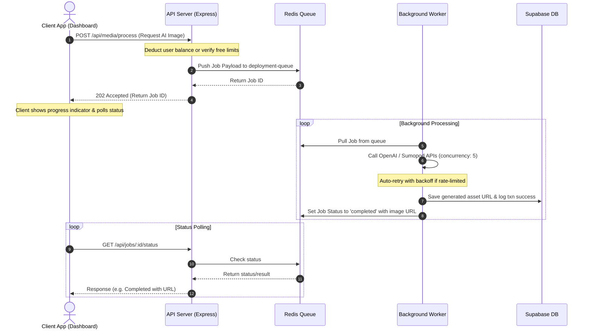

# Asynchronous Architecture & Queue Roadmap (BullMQ + Redis)

## 1. Background & Problem Statement

Currently, Wuzzkang handles high-latency, resource-intensive operations synchronously. The API server waits (`await`) directly on third-party integrations, block storage writes, and LLM processing loops. 

While simple, this synchronous approach introduces severe vulnerabilities under high concurrent loads:
1. **Gateway Timeouts (504):** External AI APIs (especially image generation) can take 5–15 seconds. Standard reverse proxies (Nginx, Cloudflare) and serverless gateways (Vercel, Railway) enforce a 10–30s timeout threshold. Slow API responses trigger connection termination, resulting in a poor user experience and orphaned balance deductions.
2. **Resource Exhaustion (Socket Starvation):** Holding connections open for long-running HTTP operations depletes the single-threaded Node.js server's socket pool, degrading performance for lightweight requests.
3. **API Rate Limiting (429):** Simultaneous requests to groq/openai/sumopod exceed Rate-Limits-Per-Second (RPS) limits, causing instant failure without retry capability.
4. **Serverless Cost Starvation:** Serverless environments charge per millisecond. Keeping a serverless thread active while waiting on third-party APIs is highly cost-inefficient.

---

## 2. Target Asynchronous Architecture

We propose migrating all heavy/unreliable processes to an asynchronous, resilient architecture utilizing **Redis** and **BullMQ**.

### Key Engineering Invariants
* **Rate Limit Resiliency:** BullMQ queues will restrict maximum active jobs (e.g., `concurrency: 5`) to match external API boundaries.
* **Auto-Recovery:** Failed jobs will employ exponential backoff policies (`attempts: 3`, `delay: 5000ms`, `backoff: exponential`).
* **Database Ledger Integrity:** User balances must be deducted *before* pushing to the queue. If the job fails permanently after all retries, the worker triggers an atomic refund transaction via `walletService.addTransaction(userId, cost, 'refund')`.

---

## 3. High-Priority Queuing Candidates

We have identified 4 primary processes for migration:

### 3.1 Asynchronous AI Image Generation (`POST /api/media/process`)
* **Current Status:** Synchronous. Deducts balance, calls OpenAI/Sumopod, downloads image, uploads to Supabase, and returns URL.
* **Impact:** 10–15s response latency. 
* **Target Flow:** Deduct balance $\rightarrow$ Queue BullMQ job $\rightarrow$ Return Job ID $\rightarrow$ Poll results.

### 3.2 Asynchronous AI Copywriting (`POST /api/generate/field`)
* **Current Status:** Synchronous. Deducts balance, calls Groq/Sumopod chat completion, returns text content.
* **Impact:** 3–6s latency. 
* **Target Flow:** Queue task $\rightarrow$ Poll result.

### 3.3 Winpay Webhook Callbacks (`POST /api/payments/webhook`)
* **Current Status:** Synchronous. Verifies signature, updates transaction table, calls `completeTransaction` (updating profiles balance).
* **Impact:** Risk of missing webhook retries if Supabase locks.
* **Target Flow:** Instantly return `200 OK` $\rightarrow$ Queue callback payload in BullMQ $\rightarrow$ Process state updates sequentially.

### 3.4 GitHub Repository Creation & Pages Deployment (`POST /api/projects/:id/deploy`)
* **Current Status:** Synchronous. Writes slug directly.
* **Impact:** Low latency but does not implement repository creation.
* **Target Flow:** If GitHub repository synchronization is reactivated, the entire repository creation, push, and CDN activation sequence should run in `deployWorker.js`.

---

## 4. Phase-by-Phase Development Roadmap

### Phase 1: Setup Infrastructure & Shared Connections
* Configure a persistent Redis pool connection helper.
* Enable `ENABLE_BG_WORKER` config flag in backend `.env` variables.
* Create a generic job status lookup router: `GET /api/jobs/:id/status`.

### Phase 2: Asynchronous AI Image Processing
* Refactor `/api/media/process` to push tasks to `avatar-queue`.
* Implement the background worker code with rate-limiters.
* Update `handleGenerateAIImage` in dashboard `generate/page.js` to poll the status API until completion.

### Phase 3: Asynchronous AI Text Processing
* Refactor `/api/generate/field` to push tasks to `text-queue`.
* Implement worker with fallback groq-to-sumopod models.
* Update copywriting buttons in the dashboard layout.

### Phase 4: Webhook Processing Queue
* Refactor payment controller webhook listener to return `200 OK` instantly and process balance allocations asynchronously.
